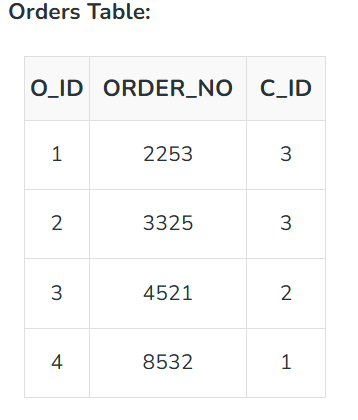
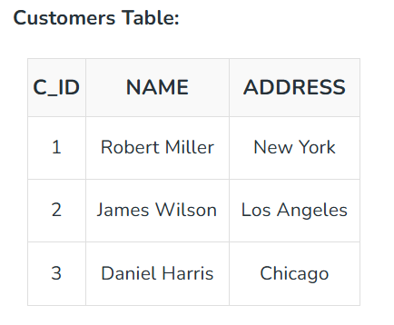

# Constraints In Mysql
> *MySQL constraints are rules enforced on data columns to ensure the accuracy, reliability, and integrity of the database. They prevent invalid data from being inserted or updated into a table.You can define constraints at the column level (applies to one column) or the table level (applies to multiple columns) when creating or altering tables.*

--- 

## Core MySQL Constraints

### **NOT NULL:** 
*Prevents a column from accepting NULL values. Every row must contain a value for this column.*
 > *The NOT NULL constraint ensures that a column cannot contain NULL values. This is particularly important for columns where a value is essential for identifying records or performing calculations. If a column is defined as NOT NULL, every row must include a value for that column.*

**Example:**
```sql
CREATE TABLE Student
(
      ID int(6) NOT NULL,
      NAME varchar(10) NOT NULL,
      ADDRESS varchar(20)
);
```
> **Explanation:** In the above example, both the ID and NAME columns are defined with the NOT NULL constraint, meaning every student must have an ID and NAME value.

 ***

### **UNIQUE:** 
*Guarantees that all values in a column or a group of columns are distinct.*
 > *The UNIQUE constraint ensures that all values in a column are distinct across all rows in a table. Unlike the PRIMARY KEY, which requires uniqueness and does not allow NULLs, the UNIQUE constraint allows NULL values but still enforces uniqueness for non-NULL entries.*

**Example:**
```sql
CREATE TABLE Student
(
ID int(6) NOT NULL UNIQUE,
NAME varchar(10),
ADDRESS varchar(20)
);
```
> **Explanation:** Here, the ID column must have unique values, ensuring that no two students can share the same ID. We can have more than one UNIQUE constraint in a table.
 *** 

### **PRIMARY KEY**
*Uniquely identifies each record. It automatically combines a **NOT NULL** and a **UNIQUE** constraint. A table can only have one primary key.*

> *A PRIMARY KEY constraint is a combination of the NOT NULL and UNIQUE constraints. It uniquely identifies each row in a table. A table can only have one PRIMARY KEY, and it cannot accept NULL values. This is typically used for the column that will serve as the identifier of records.*

```sql
CREATE TABLE Student
(
ID int(6) NOT NULL UNIQUE,
NAME varchar(10),
ADDRESS varchar(20),
PRIMARY KEY(ID)
);

```
> **Explanation:** In this case, the ID column is set as the primary key, ensuring that each student’s ID is unique and cannot be NULL.

  ***

### **FOREIGN KEY** 
*Links two tables together. It ensures referential integrity by pointing to a primary key in another table.*
> *A FOREIGN KEY constraint links a column in one table to the primary key in another table. This relationship helps maintain referential integrity by ensuring that the value in the foreign key column matches a valid record in the referenced table.* 






**As we can see clearly that the field C_ID in Orders table is the primary key in Customers table, i.e. it uniquely identifies each row in the Customers table. Therefore, it is a Foreign Key in Orders table.** 

**Example:**
```sql
CREATE TABLE Orders
(
O_ID int NOT NULL,
ORDER_NO int NOT NULL,
C_ID int,
PRIMARY KEY (O_ID),
FOREIGN KEY (C_ID) REFERENCES Customers(C_ID)
)
```
> **Explanation:** In this example, the C_ID column in the Orders table is a foreign key that references the C_ID column in the Customers table. This ensures that only valid customer IDs can be inserted into the Orders table.


 ***

### **CHECK** 
*Validates that values in a column meet a specific conditional expression (e.g., age >= 18).*
> *The CHECK constraint allows us to specify a condition that data must satisfy before it is inserted into the table. This can be used to enforce rules, such as ensuring that a column’s value meets certain criteria (e.g., age must be greater than 18)*

**Example:**
```sql
CREATE TABLE Student
(
ID int(6) NOT NULL,
NAME varchar(10) NOT NULL,
AGE int NOT NULL CHECK (AGE >= 18)
);
```

> **Explanation:** In the above table, the CHECK constraint ensures that only students aged 18 or older can be inserted into the table. 
 
   ***

### **DEFAULT** 
*Injects a predefined default value if no value is explicitly provided during data insertion.*
> *The DEFAULT constraint provides a default value for a column when no value is specified during insertion. This is useful for ensuring that certain columns always have a meaningful value, even if the user does not provide one.*

**Example:**
```sql
CREATE TABLE Student
(
ID int(6) NOT NULL,
NAME varchar(10) NOT NULL,
AGE int DEFAULT 18
);

```
> **Explanation:** Here, if no value is provided for AGE during an insert, the default value of 18 will be assigned automatically.

--- 

*** 

<!-- constraints code with explainations -->

## Constraints: data integrity ke rules (with code)

MySQL constraints columns par rules enforce karte hain taaki invalid data insert/update na ho sake aur data reliable rahe; yeh column-level ya table-level define kiye jaate hain. 

## NOT NULL — value honi zaroori hai

`NOT NULL` ensure karta hai ki column mein `NULL` accept na ho; har row mein us column ke liye ek value honi chahiye. 

- **AUTO_INCREMENT** -> yeh auto increment krta hai numbers ko !  

```sql
CREATE TABLE users (
  id INT PRIMARY KEY AUTO_INCREMENT,
  name VARCHAR(100) NOT NULL,
  email VARCHAR(255) NOT NULL
);

-- Valid
INSERT INTO users (name, email)
VALUES ('Dev', 'dev@example.com');

-- Invalid: name NULL hai → error
INSERT INTO users (name, email)
VALUES (NULL, 'x@example.com');
```

**Use when:** column kabhi bhi empty nahi hona chahiye (names, emails, required fields).

## UNIQUE — sabhi values distinct honi chahiye

`UNIQUE` guarantee karta hai ki column (ya column group) mein sabhi values alag-alag hon; duplicates allow nahi hote. 

```sql
CREATE TABLE users (
  id INT PRIMARY KEY AUTO_INCREMENT,
  email VARCHAR(255) NOT NULL UNIQUE,
  phone VARCHAR(20) UNIQUE
);

INSERT INTO users (email, phone)
VALUES ('dev@example.com', '+91-9876543210');

-- Duplicate email → error
INSERT INTO users (email, phone)
VALUES ('dev@example.com', '+91-1111111111');
```

**Use when:** uniqueness chahiye (emails, usernames, IDs).

## PRIMARY KEY — row ki unique identity

`PRIMARY KEY` automatically `NOT NULL` + `UNIQUE` hota hai aur har row ko uniquely identify karta hai; ek table mein sirf ek primary key ho sakti hai. 

```sql
CREATE TABLE users (
  id INT PRIMARY KEY AUTO_INCREMENT,
  name VARCHAR(100) NOT NULL
);
```

**Use when:** har row ki ek unique identifier chahiye (almost har table mein).

## FOREIGN KEY — tables ke beech relation + referential integrity

`FOREIGN KEY` child table ke column ko parent table ke primary/unique key se link karta hai; invalid references insert nahi hote. 
```sql
CREATE TABLE users (
  id INT PRIMARY KEY AUTO_INCREMENT,
  name VARCHAR(100) NOT NULL
);

CREATE TABLE orders (
  id INT PRIMARY KEY AUTO_INCREMENT,
  user_id INT NOT NULL,
  total DECIMAL(10,2) NOT NULL,
  CONSTRAINT fk_orders_user
    FOREIGN KEY (user_id)
    REFERENCES users(id)
    ON DELETE RESTRICT
    ON UPDATE CASCADE
);

-- Valid: user_id exists in users
INSERT INTO users (name) VALUES ('Dev');
INSERT INTO orders (user_id, total) VALUES (1, 199.99);

-- Invalid: user_id 999 users mein nahi hai → error
INSERT INTO orders (user_id, total) VALUES (999, 49.99);
```

**Use when:** related data consistent rakhna ho (orders→users, posts→users). 

## CHECK — custom condition validate karna

`CHECK` column values par custom condition enforce karta hai; MySQL 8.0.16+ mein yeh fully supported hai.

```sql
CREATE TABLE users (
  id INT PRIMARY KEY AUTO_INCREMENT,
  age INT NOT NULL,
  CONSTRAINT chk_age_adult CHECK (age >= 18)
);

-- Valid
INSERT INTO users (age) VALUES (20);

-- Invalid: age 15 → error
INSERT INTO users (age) VALUES (15);
```

**Use when:** business rules enforce karne hon (age >= 18, price > 0, status in list).

## DEFAULT — automatic default value

`DEFAULT` column mein predefined value set karta hai jab insert mein value na di gayi ho. 

```sql
CREATE TABLE users (
  id INT PRIMARY KEY AUTO_INCREMENT,
  is_active TINYINT(1) NOT NULL DEFAULT 1,
  created_at TIMESTAMP DEFAULT CURRENT_TIMESTAMP
);

-- is_active = 1, created_at = current time automatically
INSERT INTO users () VALUES ();
```

**Use when:** common default values chahiye (flags, timestamps, status).

## Combined realistic example

```sql
CREATE TABLE products (
  id INT PRIMARY KEY AUTO_INCREMENT,
  sku CHAR(12) NOT NULL UNIQUE,
  name VARCHAR(150) NOT NULL,
  price DECIMAL(10,2) NOT NULL,
  stock INT NOT NULL DEFAULT 0,
  CONSTRAINT chk_price_positive CHECK (price > 0),
  CONSTRAINT chk_stock_non_negative CHECK (stock >= 0)
);

CREATE TABLE orders (
  id INT PRIMARY KEY AUTO_INCREMENT,
  user_id INT NOT NULL,
  product_id INT NOT NULL,
  quantity INT NOT NULL,
  ordered_at TIMESTAMP DEFAULT CURRENT_TIMESTAMP,
  CONSTRAINT fk_orders_user
    FOREIGN KEY (user_id) REFERENCES users(id)
    ON DELETE RESTRICT ON UPDATE CASCADE,
  CONSTRAINT fk_orders_product
    FOREIGN KEY (product_id) REFERENCES products(id)
    ON DELETE RESTRICT ON UPDATE CASCADE,
  CONSTRAINT chk_quantity_positive CHECK (quantity > 0)
);
```

Yahan `PRIMARY KEY`, `UNIQUE`, `NOT NULL`, `DEFAULT`, `CHECK`, aur `FOREIGN KEY` sab use hue hain taaki data clean aur consistent rahe. 

## Quick decision guide

- **Value must exist** → `NOT NULL`
- **No duplicates** → `UNIQUE`
- **Row identity** → `PRIMARY KEY`
- **Link tables** → `FOREIGN KEY`
- **Custom rules** → `CHECK`
- **Auto default** → `DEFAULT`

---
--- 