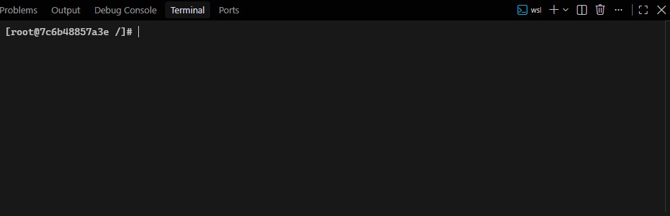
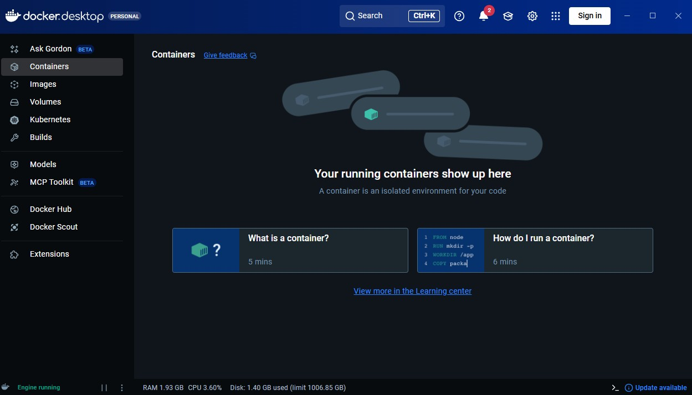
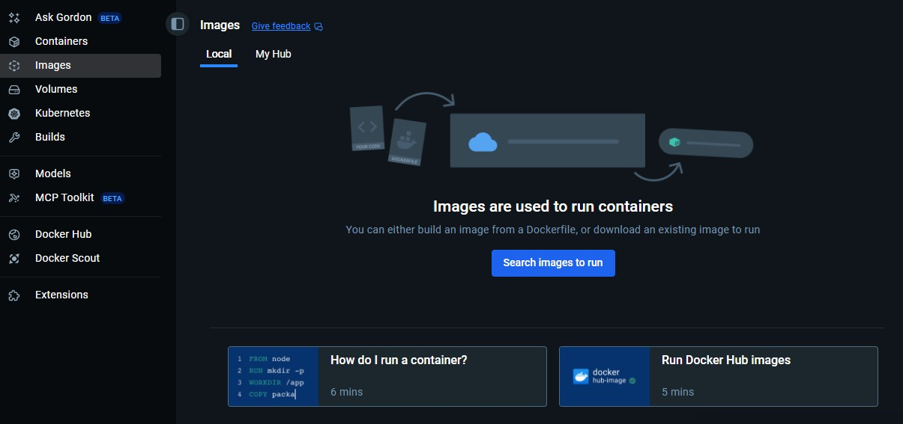

## Lets run docker and install archlinux machine 
*aur jo bhi ham containers create krte hain run krte hain with the help of docker its totally isolated from our host machine(jo bhi primary OS we using)*

---

> ### open Terminal 
- im using wsl kali ! 

```bash

sudo docker run -it archlinux

```
- *Frist is **docker run** -> docker run krega , **-it** -> means interactive mode (jisme ham jo bhi container run kr rahein hai uska terminal use kr skte hain),   arch -> this is the name of the container we runing using the docker*

- *yeh uss container ki image ko locally find krega, ager pahle koi image hogi to yeh turant run hoga container nhi to yeh -> docker.hub se uski image ko pull krta hai.*

- *jab docker image pull kr leta hai or uski help se ek container create krta hai aur use run kta hai the u see k hamara terminal now logged in as archlinux ->*



- this is my terminal ->


- **Lets run some command and i show you**

```sh

pacman -Syy

pacman -Sy fastfetch

## now run this tool 

fastfetch 

## and see 
```

-  **-> this container is saperated from our system**

- **is that same as vm (virtual machine) we see it** 

--- 

## Start you docker desktop 🐳

- THis is the GUI of docker desktop 
- The containers section in docker 


---

- The images section in docker 



---

**just these two sections are for now we important to learn i see it**
