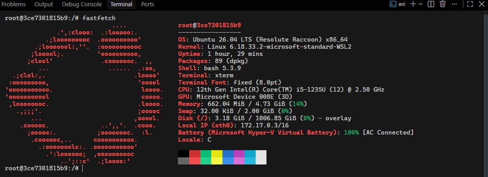

## Docker hub Images and how to use it using Docker 

> ### *Docker Commands ->*

```sh 

# 1)
docker pull IMage_name # put your image name (checkout docker.hub to see)

## ager yeh image locally nhi hogi to docker use docker.hub se he pull krta hai 

## 2) 
docker images 


## let pull one 
sudo docker pull hello-world

sudo docker images 

# to see all images (also checkout into your docker desktop)
```
> NOTE -> *i'm using wsl so mai jo bhi docker images containers create kr raha hun vo mere wsl env mein hai so vo images mere windows OS mein jo docker desktop installted hai usmin show nhi hongi , ! ager usemein dekhna hai to use pwsh (powershell or cmd ) but im working with cli so its greatest for me now*


1) *i need a docker image to create and run containers ! (yeh step ham ne kr liya hai)*


2) *Run that image* 

```sh 
sudo docker run Image_name # 

```

- *ham kisi bhi docker image se ek container ko create kr skte hain lets see*

```sh 

❯ sudo docker run hello-world

## now you can see k ek container create ho gya aur execute bhi hogiya hello from docker show ho giya hoga.. 

```

## let create ubuntu container

```sh 

❯ sudo docker pull ubuntu

❯ sudo docker images

❯ sudo docker run -it ubuntu   ## -it for interactive mode, jisemine ham us container k terminal ko access kr skte hain or opertions perform kr skte hain 

❯ sudo docker run -it ubuntu 


```

- **when we into the ubuntu terminal lets do somthing**

```sh 

root@3ce7301815b9:/# apt update 

root@3ce7301815b9:/# apt install -y fastfetch

## run and see 
```



---

- **lets run arch container**

```sh 

❯ sudo docker images

❯ sudo docker run -it archlinux

```

-  **arch machine terminal**

```sh 

[root@981fff470a64 /]# pacman -Syy 

[root@981fff470a64 /]# pacman -Syu fastfetch

[root@981fff470a64 /]# fastfetch

```


---
***

## Let see How many Containers we have 

```sh 

## -a for all the containers 
❯ sudo docker container ls -a

## same to see all containers
❯ sudo docker ps -a 

```

## How many Are running let see 
```bash 
## to see how many containers are running (up) right now 
❯ sudo docker ps  

## ro see all running containers 
❯ sudo docker container ls 

```


## docker run VS docker start 
- *jab bhi ham docker run command run krte hain new  container create hota hai (so make sure k yeh command pahli bar run krne k bad har bar run nhi krna)*

- **docker stop** *se ham containers ko stop krte hain* 

```sh 

❯ sudo docker ps

## let run ubuntu container -> 


❯ sudo docker start 3ce7301815b9  ## using the container id 

❯ sudo docker start  upbeat_hamilton  ## using the container name (jo bhi NAMES MEIN SHOW HOTA HAI ) 

## NOTE - ager container run ho gya hoga to usna name yan container id start command k just neche show hogi 
## lets checkout 

❯ sudo docker ps

```


## Stop the running Containers 📦🧊

```sh 

❯ sudo docker stop upbeat_hamilton ## or also i can use the id of the container

❯ sudo docker stop 3ce7301815b9

❯ sudo docker container ls 

## NOTE WE can stop multiple containers at once's

❯ sudo docker stop upbeat_hamilton magical_sinoussi 

❯ sudo docker container ls 

```

## Removing Images and Containers 

```bash 

## just like docker images command 
❯ sudo docker image ls 

## rmi for - Images 
❯ sudo docker rmi hello-world

## now this error -> Error response from daemon: conflict: unable to remove repository reference "hello-world" (must force) - container f6ece9662030 is using its referenced image e2ac70e7319a

## means hamein pahle us image se create huye containers ko rm krna hoga 

❯ sudo docker container -a

## - rm -> for containers
❯ sudo docker rm  wonderful_noether ## remove container  using name 

❯   sudo docker rm  e9e7857d334e ## remove container  using container id  


## NOTE -> we can also remove multiple containers 

❯ sudo docker rm ae47fee41f2c 44bf5f287a97

## checkout about containers 
❯ sudo docker container -a

## now remove images 
# Note -> we can remove images more then on at onces  and using image id and image name also choose what u want 

❯ sudo docker images 

❯ sudo docker rmi hello-world

❯ sudo docker rmi docker/welcome-to-docker
