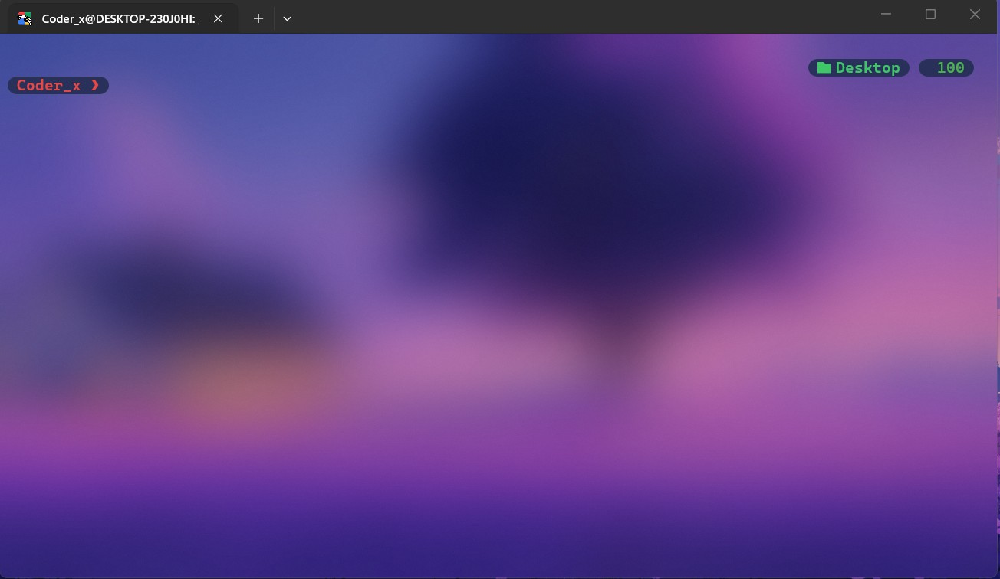
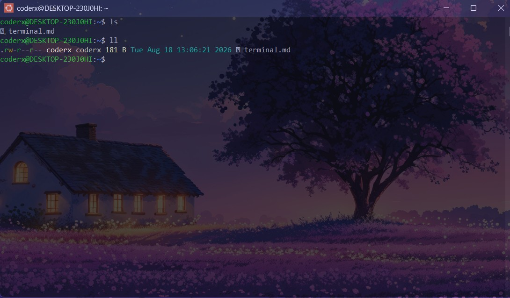

## After install and setup your linux distro lets do somethings -> 

## What is Terminal first ! 
- In Linux, a CLI terminal (Command-Line Interface) is a text-based environment used to interact directly with the operating system. Instead of clicking icons or buttons like in a Graphical User Interface (GUI), you type text commands to create files, install software, run scripts, and manage the system.


1) Terminal Emulator - 
   - The visual window or application that opens on your desktop. It captures your keyboard inputs and displays the text output.  -> examples GNOME Terminal, Konsole, Alacritty, Kitty etc. 

2) Shell - 
   - The command interpreter running inside the window. It takes the text commands you type, translates them for the operating system kernel, and sends back the output. -> Bash (default on most Linux systems), Zsh, Fish 

3) CLI CommandsThe actual instructions or utilities you run inside the shell to perform tasks.ls (list files), cd (change directory), mkdir (make folder) , we see in detail.. 


--- 
## this is my WSL kali terminal 
- im not using any vm so ! 
- i know mostly terminals are black 😅 



--- 

- maine just customizations kri hai 




## Run your basic command (day1 01 ) -> 

```sh 

## first check system update 

sudo apt update 

## also do 
apt-get update 

## install python linux 
## in linux we use python3 
sudo apt install python3 


## let do some interesting 

sudo apt install fastfetch lolcat 

fastfetch 

fastfetch | lolcat 

## give a try 

```