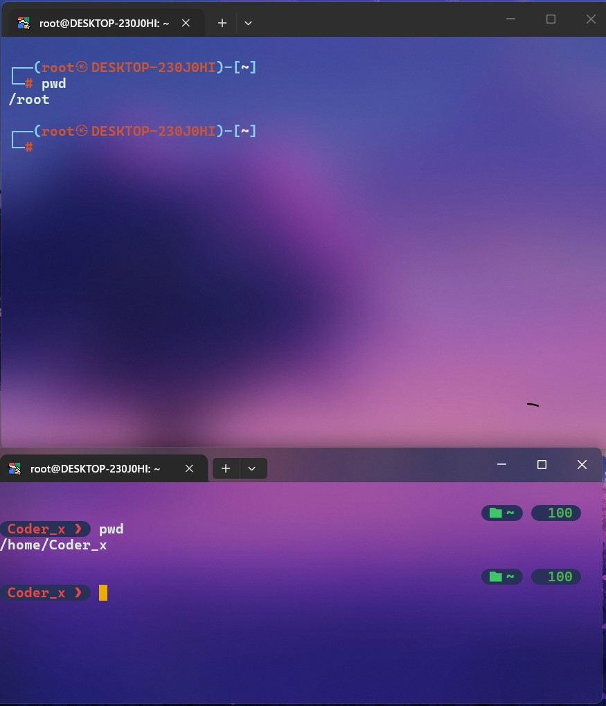

# Lets Dive into linux Basic Commands 
  ## -> File Navigation ( how to move in terminal )
  - **First open linux terminal i and type first FileNavigation Command ->**

## PWD -> ( pwd ) - print current direactory / print current working directory ! 
```sh 

pwd 

```

-> Pwd Command Image 



- Now see har differ path (path is the location of your in system! means jis jagah par ho system mai curretly !, pwd differ output deta hai differ paths k anusar ! its good way to find ourself in system )

> *i hope you have knowledge of home and root directory ? the main differ etc..*

--------------- 

## What Is a Working Directory?
Every shell session has a current working directory.

Think of it as:

> "The directory I'm currently standing inside."


## CD -> (cd ) - Change Directory , changes the shell's current working directory.
- change location in system or jump to other directory(folers called directory in linux)

> let say hamein kisi or foler mein jana hai but how i know how much folders (and files also) i have ? main kaise dekhunga in linux cli ? here comes -> 
  ## LS -> ( ls ) Listing 
  *listing all files and folders etc in your current path, location or directory!*

```sh

ls 

```


> keep in mind, it list all the files and folder , in your current directory ager koi bhi files folders etc  nhi hai to kuch bhi list nhi hoga show nhi hoga so make sure k current folder mein kuch to ho, but ager nhi hai now lets move on cd command 


> i have test coder in my root foler so i want to jump within and let checkout what inside this folder !  
```sh

## 
cd <foldername> 

cd Test 

## NOTE - TAB key also helps u most of your work to auto complete the names of files and folers 

```
> cd , pwd and ls -> 


  ## ls -l  and ls -ls -> listing in long format 
    - means listing with more detail like more info about your suff there ! 

 ```sh 

 ls -l 

 ## and same with 
 ls -ls 

``` 


> see the differ info !, its good to hands on onces , bad mein hame yeh bhot use krna hai let move to other -> 

  - #### now i have to go inside other folder, jo bhi mere current folder mien hai but kinte folder hai ? ager mein last tak jana hai to muje kiya ek-ek folder jump krna hoga ? nhi let see one by one !... 

  First see how to list all the folder means if there is folder inside folder and then other folder and then folder inside foler oooohhhh hhow much you cd and ls ! 😅🙄😣 so let see how to do that 

  ## ls -lR and ls -R 
   - -R for recursively , means ager koi folder k ander foler etc hai to yeh usse bhi list krta hai

  
  > ager har folder mein kafi stuff hai to yeh bhot jyida long hoga, ager data bhot jiyda hai like if u know about the node_modules ager use foler ko list kra -R to bhot computation + time lagega make sure you put mind when you use this !! command yeh maje maje mein run krne vali nhi hai.. 

  ## How to go back ? from any directory ! 
   ## CD .. ( cd .. ) means Parent directory. 
   - cd space double dots means back from current folder and jis path par ho usse piche chlejaoge !!  

   

   > other think is using cd but two thinks need to know first your destination folder ! and his proper path means -> 
       if have are right now on the /root/test  -> folder right ! 
      or hamein jump krna hai /etc/zsh/   > inside this foler 

       Now jo path hai vo hai  / -> its the start of linux file system (root directory top of linux system, like C:/ in windows somethink like but differ ! )

       /etc -> foler inside folder 
       /etc/zsh  -> /zsh the destination foler i wanna go! 

        note make sure you have to know full absolute path its /root/test/scripts etc  

         /root -> is the home directory of root user like , yeh hamein tabhi milti hai jab ham as sudo user (root user login hote hain ! ) 
         
          Otherwise ->
         
         /home/yourUsername   ->      
       
        
      . -> one dot mean current position , ager hame koi file folder use kr rahe hai ham ./ use krte hain lets see -> 

   

        /       → root directory
        /root   → root user's home directory

  > NOTE other usefull command -> 

  ## cd ../../../  -> like back from multiple folders 

```sh 

   cd ../../../

```

  ## ls -a (-a means all hidden files and folders included !)
   -Show all entries, including hidden entries.
   - Linux hidden files/directories generally begin with: .  .bashrc  .zshrc .hiddencustomfile etc 
   - yeh folders or files normal ls par yan ls -ls par show nhi hote 
```sh 

ls -a 

ls -als 

ls -lsaR  

ls -lah

```

     -l → long format
     -a → all entries
     -h → human-readable sizes

 > that's all about the file navigation commands 


---------
## clear -> for clear your mess in terminal 😅

```sh 
clear

## note use ctrl + L to clear also 
```

## cd ~ -> for home directory shortcut 
means we jump directly to the your users home directory using this command 

```sh

pwd 

cd ~

```


---------
   
## cd ../foldername    -> back from current and jump other 


```sh 
pwd 

cd ~ 

cd ../etc/zsh/ 

pwd 

```


<!-- 
 -->
