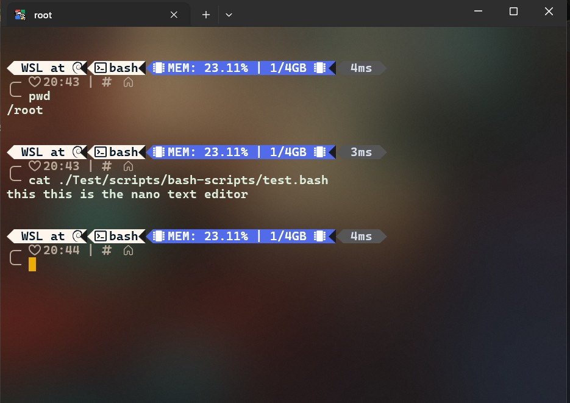
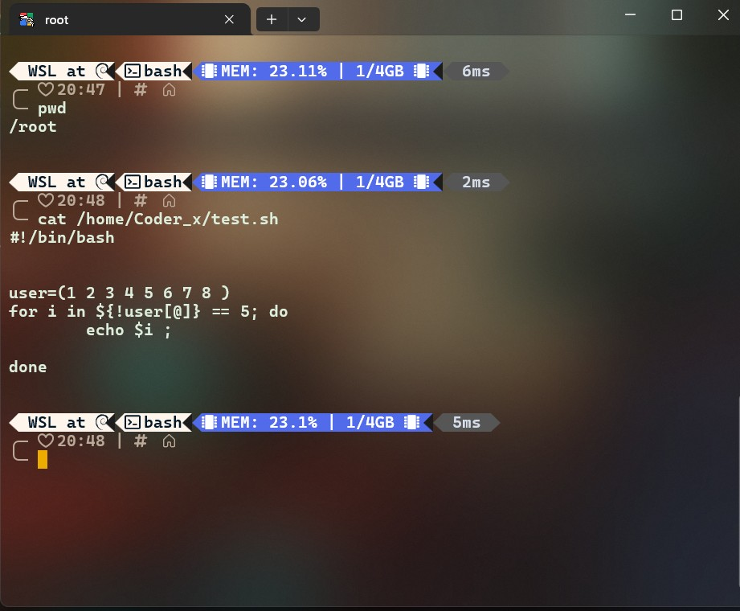
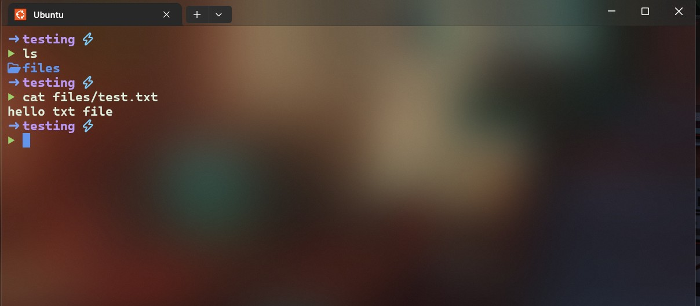

# Linux Paths: Absolute vs Relative Paths 🐧

This is one of the most important Linux fundamentals because almost everything you do in Linux involves locating files and directories.

For example:

Bash

```
cd /home/coder_x/Documents
```

How does Linux know where to go? The answer is paths.

## 1. What Is a Path?

### Technical Definition

A path is a sequence of directory names that identifies the location of a file or directory in a filesystem.

A path tells the operating system where a particular file or directory is located.

### Easy Explanation (Hinglish)

Path ka simple matlab hai:

> Kisi file ya folder ka address.

Jaise ghar ka address hota hai, waise Linux mein file/folder ka address hota hai.

Example:

```
/home/coder_x/Documents/notes.txt
```

Iska matlab:

* `/` → Root directory

* `home` → Home directory ke andar

* `coder_x` → User ka folder

* `Documents` → Documents folder

* `notes.txt` → File

## Linux Filesystem Address


## 2. Absolute Path

### Technical Definition

An absolute path is a complete path that starts from the root directory (`/`) and identifies a file or directory regardless of the current working directory.

It always begins from the filesystem's root.

### Syntax

Bash

```
/starting-from-root/path/to/file
```

### Example

Bash

```
/home/coder_x/Documents/notes.txt
```

This is an absolute path because it starts with `/`.

### Hinglish Explanation

Absolute path matlab:

> Root `/` se lekar destination tak poora address.

Aap terminal mein kahin bhi ho, agar path correct hai, Linux us location ko identify kar sakta hai.

### Practical Example

Suppose your current directory is:

Bash

```
/home/coder_x
```

You can open or access a file using its complete address:

Bash

```
cat /home/coder_x/Documents/notes.txt
```

Now suppose you move somewhere else:

Bash

```
cd /tmp
```

You can still access the same file:

Bash

```
cat /home/coder_x/Documents/notes.txt
```

Why? Because the path starts from `/`, not from your current location.

## 3. Relative Path

### Technical Definition

A relative path identifies a file or directory relative to the current working directory.

It does not begin from the root. Linux interprets it based on where you currently are.

### Hinglish Explanation

Relative path matlab:

> Abhi main jis folder mein hoon, uske according destination ka address.

Ismein poora address likhne ki zarurat nahi hoti.

### Example Directory Structure

```
/home/coder_x/
└── Documents/
    ├── notes.txt
    └── Projects/
        └── app.js
```

Suppose you are currently here:

Bash

```
/home/coder_x/Documents
```

To access `notes.txt`:

Bash

```
cat notes.txt
```

To access `app.js` inside `Projects`:

Bash

```
cat Projects/app.js
```

These are relative paths.

## 4. Absolute vs Relative — Main Difference

## Absolute Path

Starts from `/`

Bash

```
/home/coder_x/Documents/notes.txt
```

Meaning: Complete address from root.

Depends on current directory? No.



-----



## Relative Path

StsdssBash
Documents/notes.txt
```



Meaning: Address relative to where you are.

Depends on current directory? Yes.


### Comparison Table


## 5. Important Symbols You Must Know

Linux paths use a few special symbols.

/

`/` — Root Directory

The starting point of the Linux filesystem.

Bash

```
cd /
```

Hinglish: Linux filesystem ka sabse top-level folder.

~

`~` — Home Directory

Represents the current user's home directory.

Bash

```
cd ~
```

Hinglish: Aapke user ka personal home folder.

Example: `/home/coder_x`

.

`.` — Current Directory

Represents the directory you are currently inside.

Bash

```
ls .
```

Hinglish: Jis folder mein abhi aap khade ho.

..

`..` — Parent Directory

Represents the directory one level above the current directory.

Bash

```
cd ..
```

Hinglish: Current folder ka ek level upar wala folder.

## 6. Understand `.` and `..` With a Real Example

Suppose your current location is:

```
/home/coder_x/Documents/Projects
```

### Current Location

Imagine you are standing inside this directory:

```
/home/coder_x/Documents/Projects
```

`.` means:

```
/home/coder_x/Documents/Projects
```

`..` means:

```
/home/coder_x/Documents
```

`../..` means:

```
/home/coder_x
```

### Commands

Bash

```
pwd
```

Output:

```
/home/coder_x/Documents/Projects
```

Go one level up:

Bash

```
cd ..
```

Now:

Bash

```
pwd
```

Output:

```
/home/coder_x/Documents
```

Go two levels up from Projects:

Bash

```
cd ../..
```

Result:

```
/home/coder_x
```

### Hinglish

* `.` = yahin current folder

* `..` = ek folder peeche / upar

* `../..` = do folders upar

## 7. Same Destination Using Different Paths

Suppose this structure exists:

```
/home/coder_x/
└── Documents/
    └── Projects/
        └── app.js
```

### Method A — Absolute Path

From anywhere:

Bash

```
cat /home/coder_x/Documents/Projects/app.js
```

### Method B — Relative Path

If you are inside:

```
/home/coder_x/Documents
```

Then:

Bash

```
cat Projects/app.js
```

### Method C — Using `~`

If your home directory is `/home/coder_x`:

Bash

```
cat ~/Documents/Projects/app.js
```

This is a path using the home shortcut.

> Note: `~` is expanded by the shell to your home directory. It is not the same thing as the root `/`.

## 8. How to Check Your Current Directory

Before using relative paths, you should know where you are.

### Command: `pwd`

Technical Definition: `pwd` means print working directory. It displays the absolute path of the current working directory.

Bash

```
pwd
```

Example output:

```
/home/coder_x/Documents
```

### Hinglish

`pwd` ka matlab:

> Main abhi kis folder ke andar hoon?

### Why It Matters

If you run:

Bash

```
cat notes.txt
```

Linux searches for `notes.txt` in your current directory.

So if you don't know your current location, relative paths can become confusing.

## 9. Practice: Absolute and Relative Navigation

You can practice this in your Linux terminal, WSL, VM, or another Linux environment.

### Step 1 — Check your location

Bash

```
pwd
```

### Step 2 — Go to the root directory

Bash

```
cd /
```

### Step 3 — List its contents

Bash

```
ls
```

### Step 4 — Go to your home directory

Bash

```
cd ~
```

### Step 5 — Check your location

Bash

```
pwd
```

### Step 6 — Create a practice structure

Bash

```
mkdir -p linux-practice/level1/level2
```

### Step 7 — Enter `level2`

Bash

```
cd linux-practice/level1/level2
```

### Step 8 — Check the absolute path

Bash

```
pwd
```

### Step 9 — Go one level up

Bash

```
cd ..
```

### Step 10 — Go back into `level2`

Bash

```
cd level2
```

### Step 11 — Go two levels up

Bash

```
cd ../..
```

### Step 12 — Return home

Bash

```
cd ~
```

## 10. Common Mistakes

Mistake 1: Confusing `/` and `~`

Bash

```
cd /
```

Goes to the root.

Bash

```
cd ~
```

Goes to your home directory.

They are not the same.

Mistake 2: Using a Relative Path From the Wrong Location

Bash

```
cat Documents/notes.txt
```

This only works if `Documents` exists inside your current directory.

If you are somewhere else, it may produce:

```
No such file or directory
```

Mistake 3: Forgetting Spaces in Directory Names

If a directory is named `My Documents`, this will not work as intended:

Bash

```
cd My Documents
```

Use quotes:

Bash

```
cd "My Documents"
```

Or escape the space:

Bash

```
cd My\ Documents
```

## 11. Professional Understanding

Absolute and relative paths are used everywhere in Linux:

* Shell scripts: Referencing files and directories.

* Configuration files: Specifying locations.

* Web servers: Nginx, Apache, and application directories.

* Permissions: Applying access rules to specific paths.

* Backups: Selecting source and destination directories.

* Docker: Mounting host paths into containers.

* SSH: Navigating remote filesystems.

* Build tools: Locating source code and output files.

### Important Professional Tip

For scripts and automation, absolute paths can be safer when you need a predictable location, because the script does not depend on where it is executed from.

However, relative paths are also useful when a project is designed to work from a specific project directory.

## 12. Quick Revision Cheat Sheet

## Path Cheat Sheet

<table class="_6IUVGW_Table" data-d-column-sizing="auto" data-d-dividers="" style="table-layout: auto;"><tbody data-d-component="table-section"><tr data-d-component="table-row"><td data-d-component="table-cell" data-d-has-width="" data-d-valign="start" style="width: 72px;"><p class="w6asjq_TextBase _85PZeG_Text" data-d-component="text"><span class="w6asjq_TextBase _85PZeG_Text" data-d-component="text" data-d-default-strong="" data-d-inline="">Symbol</span></p></td><td data-d-component="table-cell" data-d-valign="start"><p class="w6asjq_TextBase _85PZeG_Text" data-d-component="text"><span class="w6asjq_TextBase _85PZeG_Text" data-d-component="text" data-d-default-strong="" data-d-inline="">Meaning</span></p></td><td data-d-component="table-cell" data-d-valign="start"><p class="w6asjq_TextBase _85PZeG_Text" data-d-component="text"><span class="w6asjq_TextBase _85PZeG_Text" data-d-component="text" data-d-default-strong="" data-d-inline="">Example</span></p></td></tr></tbody><tbody data-d-component="table-section"><tr data-d-component="table-row"><td data-d-component="table-cell" data-d-valign="start"><p class="w6asjq_TextBase _85PZeG_Text" data-d-component="text"><code class="er4J8W_Code" data-d-component="code">/</code></p></td><td data-d-component="table-cell" data-d-valign="start">Root directory</td><td data-d-component="table-cell" data-d-valign="start"><p class="w6asjq_TextBase _85PZeG_Text" data-d-component="text"><code class="er4J8W_Code" data-d-component="code">cd /</code></p></td></tr><tr data-d-component="table-row"><td data-d-component="table-cell" data-d-valign="start"><p class="w6asjq_TextBase _85PZeG_Text" data-d-component="text"><code class="er4J8W_Code" data-d-component="code">~</code></p></td><td data-d-component="table-cell" data-d-valign="start">Home directory</td><td data-d-component="table-cell" data-d-valign="start"><p class="w6asjq_TextBase _85PZeG_Text" data-d-component="text"><code class="er4J8W_Code" data-d-component="code">cd ~</code></p></td></tr><tr data-d-component="table-row"><td data-d-component="table-cell" data-d-valign="start"><p class="w6asjq_TextBase _85PZeG_Text" data-d-component="text"><code class="er4J8W_Code" data-d-component="code">.</code></p></td><td data-d-component="table-cell" data-d-valign="start">Current directory</td><td data-d-component="table-cell" data-d-valign="start"><p class="w6asjq_TextBase _85PZeG_Text" data-d-component="text"><code class="er4J8W_Code" data-d-component="code">ls .</code></p></td></tr><tr data-d-component="table-row"><td data-d-component="table-cell" data-d-valign="start"><p class="w6asjq_TextBase _85PZeG_Text" data-d-component="text"><code class="er4J8W_Code" data-d-component="code">..</code></p></td><td data-d-component="table-cell" data-d-valign="start">Parent directory</td><td data-d-component="table-cell" data-d-valign="start"><p class="w6asjq_TextBase _85PZeG_Text" data-d-component="text"><code class="er4J8W_Code" data-d-component="code">cd ..</code></p></td></tr><tr data-d-component="table-row"><td data-d-component="table-cell" data-d-valign="start">Absolute</td><td data-d-component="table-cell" data-d-valign="start">Complete path from root</td><td data-d-component="table-cell" data-d-valign="start"><p class="w6asjq_TextBase _85PZeG_Text" data-d-component="text"><code class="er4J8W_Code" data-d-component="code">/home/user/file</code></p></td></tr><tr data-d-component="table-row"><td data-d-component="table-cell" data-d-valign="start">Relative</td><td data-d-component="table-cell" data-d-valign="start">Path from current directory</td><td data-d-component="table-cell" data-d-valign="start"><p class="w6asjq_TextBase _85PZeG_Text" data-d-component="text"><code class="er4J8W_Code" data-d-component="code">../file</code></p></td></tr></tbody></table>

### One-Line Summary

> Absolute path = root `/` se complete address. Relative path = current directory se address.

### Next Topic

The natural next lesson is Linux Filesystem Hierarchy (`/`, `/home`, `/etc`, `/var`, `/usr`, `/bin`, `/tmp`, `/dev`, `/proc`, etc.), because understanding these directories will make Linux navigation much easier.
