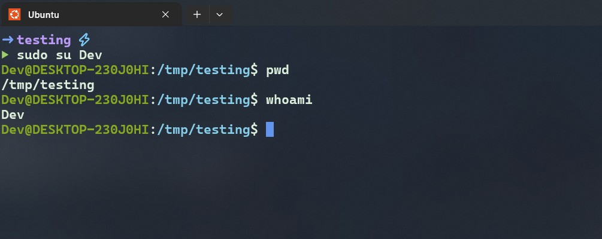
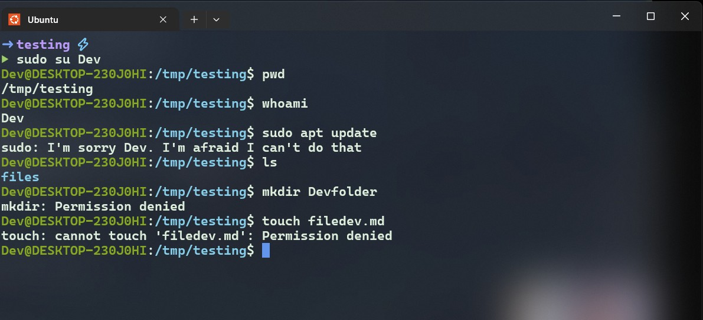
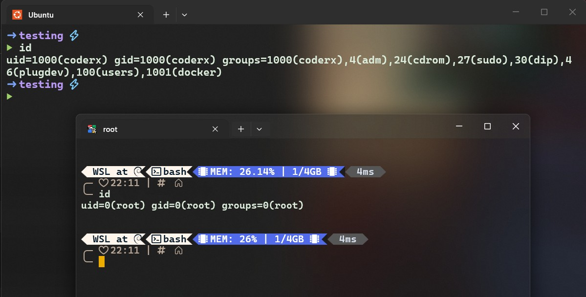
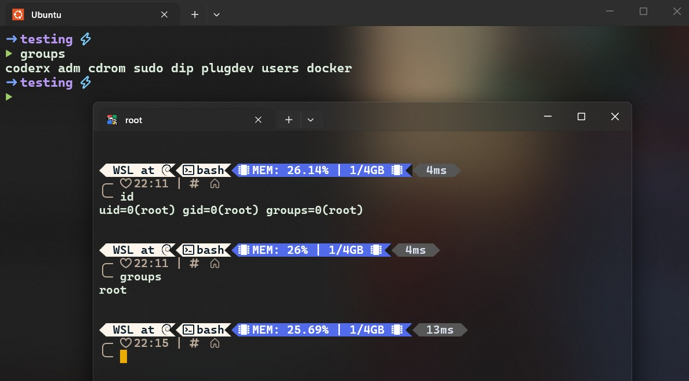
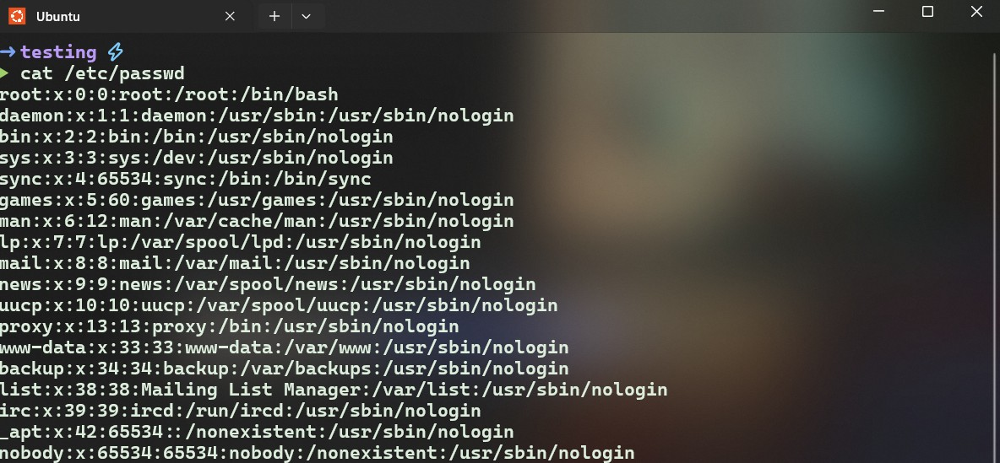
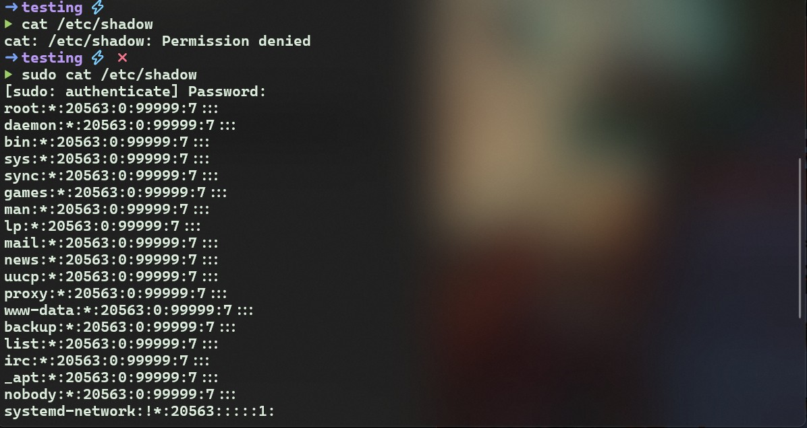

## Creating Users 
- Lets play with users 


## Current user (current logged in user)
```sh 

whoami 

``` 
# Creating Users
  ### 1)  Create user with ( $ sudo adduser Username  )
   ### 2)  create user with ( $ sudo useradd Username ) 


  ##  1) adduser 
   - adduser is a higher-level, more interactive user-creation utility available on many Debian-based systems, including Ubuntu and Debian. 
       
```txt
       It usually guides you through:

       Password creation

       Full name

       User information

       Home directory setup

```

```sh 

sudo adduser Username

sudo adduser Testuser


```
- **ager ese command ko hit krte ho to pahle password type krna hota hai new user k liye ! or bad mein baki detail jo ki skip kr skte hain** 

## check user (login with new user)
```sh 
sudo su Username 

sudo su Testuser

## now you login as new user !! 

```



*******




-------

   ## 2) useradd 
    - useradd is a low-level command used to create a new user account.
  
 ```sh 

   sudo useradd [options] username

  ```
 
   ## Recommeded Basic Form 

   ```sh 

     sudo useradd -m -s /bin/bash  username (test)


   ```
   #### *Meaning:*
   
   >  **-m**: Create the home directory
   
   >  **-s /bin/bash**: Set Bash as the login shell
 
  

  -----

  ## setup password for new user

  

  ## login new user -> 

  

  ********* 

  

-------------


#### Important `useradd` Options

| Option | Definition                                | Example                  |
| ------ | ----------------------------------------- | ------------------------ |
| `-m`   | Create home directory                     | `useradd -m devuser`     |
| `-M`   | Do not create home directory              | `useradd -M serviceuser` |
| `-d`   | Specify home directory                    | `-d /home/custom`        |
| `-s`   | Set login shell                           | `-s /bin/bash`           |
| `-u`   | Specify UID                               | `-u 1500`                |
| `-g`   | Set primary group                         | `-g developers`          |
| `-G`   | Set supplementary groups                  | `-G developers,sudo`     |
| `-c`   | Set comment/full name                     | `-c "Development User"`  |
| `-e`   | Set account expiration date               | `-e 2027-01-01`          |
| `-f`   | Set password inactivity period            | `-f 30`                  |
| `-r`   | Create a system account                   | `-r serviceuser`         |
| `-U`   | Create a private group with the same name | `-U devuser`             |
| `-N`   | Do not create a private group             | `-N devuser`             |
| `-k`   | Use a skeleton directory                  | `-k /etc/skel`           |
| `-b`   | Set base directory for home directories   | `-b /home`               |

-------------

#### Professional Example

```sh
sudo useradd \
  -m \
  -s /bin/bash \
  -c "Application Developer" \
  devuser
```

#### Warning About `useradd -p`

Avoid this:

```sh
sudo useradd -p mypassword devuser
```

Problems:

* `-p` expects an encrypted password, not normal plain text

* The password may be stored in shell history

* It may be visible to other users through process inspection in some situations

Prefer:

```sh
sudo passwd devuser
```

-------

* `useradd` = manual and powerful

* `adduser` = guided and beginner-friendly

------ 

   

## User  Information (with id command)

> Displays the current user's UID, GID, and group memberships.





------

## Groups (kin groups ka part hai user ? )




-----


## Linux User Database Files 
- Linux stores local user and group information in several important files.

  ### **/etc/passwd**
   - #### */etc/passwd stores basic information about local user accounts.*



---

  ### **/etc/shadow
   - #### /etc/shadow stores password hashes and password-aging information



----- 


##  /etc/gruop 
- contains local gruop information 

```sh

sudo cat /etc/gruop

```


---- 

## /etc/gshadow
 - Stores additional secure group information, including group administrator and membership-related data.

```sh
sudo cat /etc/gshadow

```


-------- 


