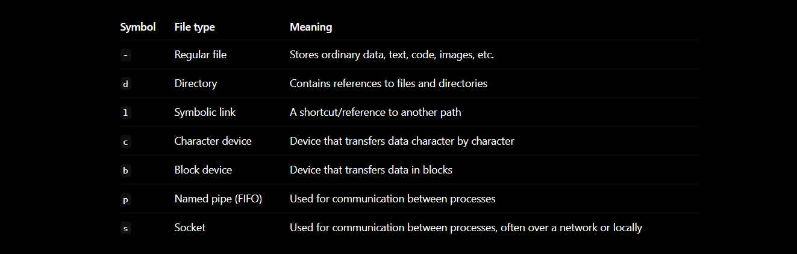
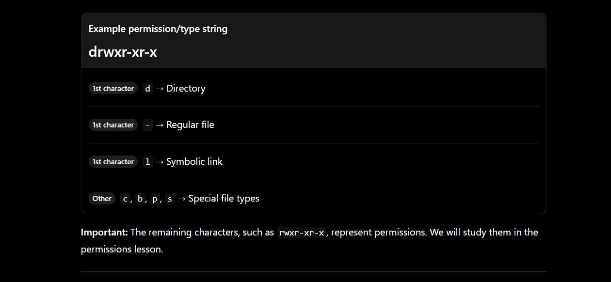
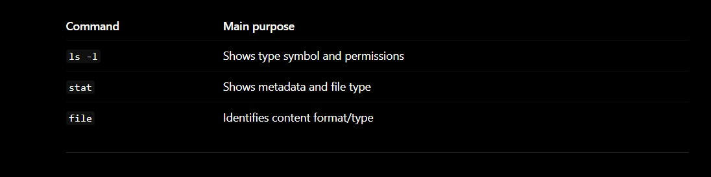
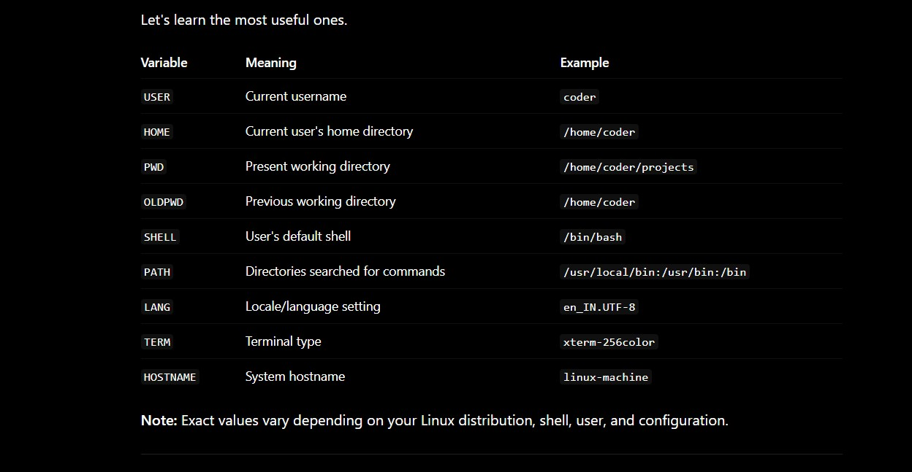
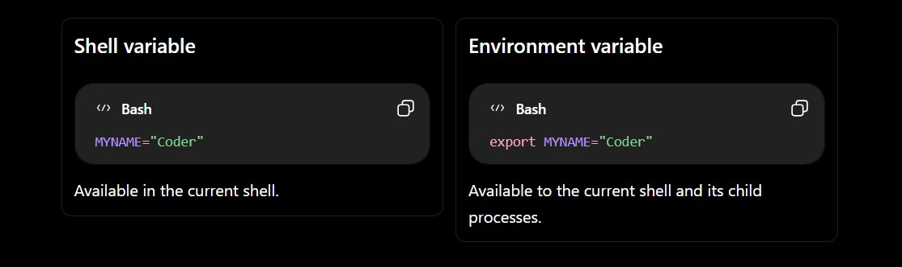

# — Files, Directories & Text

## Lesson: File Types, Hidden Files, Inodes & Links

These two topics are important because Linux does not treat a file as just “a name with some data.” Behind every file, Linux uses metadata, an inode, and a filesystem structure to manage it.

We’ll learn in this order:

1

File types — What kinds of objects exist in Linux?

2

Hidden files — How does Linux hide and show files?

3

Inodes — What is the identity and metadata of a file?

4

Links — How can multiple names point to the same data?

5

Practice — Verify everything in your Linux terminal.


# Part 1 — Linux File Types

## 1. Technical Definition

In Linux, a file type identifies what kind of filesystem object an entry represents.

Linux follows the principle that “everything is a file”—meaning many resources, including devices and communication channels, are represented through file-like interfaces. However, not every file-like object is an ordinary data file.

The main file types you should know are:




### Easy Hinglish

Linux mein har entry same type ki nahi hoti.

* Normal text file → regular file

* Folder → directory

* Shortcut → symbolic link

* Hard disk/device interface → block or character device

* Do programs ke beech communication → pipe/socket

Important: Directory bhi technically ek filesystem object hai. It stores names and references to other objects rather than ordinary user data like a text file.

## 2. Regular Files

A regular file is the most common file type. It stores data as a sequence of bytes.

Examples:

```
notes.txt
app.js
photo.jpg
index.html
database.sql
```

A regular file can contain:

* Text

* Source code

* Binary programs

* Images

* Videos

* Compressed archives

* Configuration data

### Check a file type

Bash

```
file notes.txt
```

Example output:

```
notes.txt: ASCII text
```

For an image:

Bash

```
file photo.jpg
```

Example:

```
photo.jpg: JPEG image data
```

> `file` examines the content and metadata to identify what a file likely contains. It is not the same as checking the first character of `ls -l`.

## 3. Directories

A directory is a filesystem object that maps names to file objects.

For example:

```
/home/coder/
├── notes.txt
├── app.js
└── projects/
```

Here, `coder` and `projects` are directories, while `notes.txt` and `app.js` are regular files.

### Check directory type

Bash

```
file projects
```

Or:

Bash

```
ls -ld projects
```

Output may look like:

```
drwxr-xr-x 2 coder coder 4096 Sep 17 22:00 projects
```

The first character `d` means directory.

### Important concept

A directory does not contain the entire file's data directly in the usual sense. It contains directory entries that associate names with inode numbers. The inode and filesystem structures help locate the actual file data.

We will explore this deeply in the inode section.

## 4. Symbolic Links

A symbolic link, or symlink, is a special file that stores a path pointing to another file or directory.

Think of it as a shortcut.

```
original.txt  ───────►  actual data
shortcut.txt  ───────►  original.txt
```

Create one:

Bash

```
ln -s original.txt shortcut.txt
```

Check:

Bash

```
ls -l
```

Example:

```
-rw-r--r-- 1 coder coder 12 Sep 17 22:00 original.txt
lrwxrwxrwx 1 coder coder 12 Sep 17 22:01 shortcut.txt -> original.txt
```

The first character `l` indicates a symbolic link.

Note: Symbolic links will be explained properly in the links section.

## 5. Character Devices and Block Devices

These are especially important when working with Linux systems, servers, and hardware.

### Character device — `c`

A character device handles data as a stream of characters or bytes.

Examples may include:

* Terminal devices

* Serial devices

* Some input devices

Example:

Bash

```
ls -l /dev/tty
```

You may see something like:

```
crw-rw-rw- 1 root tty ...
```

The `c` means character device.

### Block device — `b`

A block device handles data in blocks and is commonly used for storage devices.

Examples:

* Hard drives

* SSDs

* Disk partitions

Check:

Bash

```
ls -l /dev/sda
```

Or on many modern systems:

Bash

```
lsblk
```

Possible output:

```
NAME   MAJ:MIN RM  SIZE RO TYPE MOUNTPOINTS
sda      8:0    0  100G  0 disk
└─sda1   8:1    0   99G  0 part /
```

Here, `disk` and `part` describe block storage devices.

> Device names differ between systems. Your machine may use `nvme0n1`, `vda`, `sda`, etc.

## 6. Named Pipes (FIFO)

A named pipe is a special file that allows one process to send data to another process.

FIFO means First In, First Out.

Create one:

Bash

```
mkfifo mypipe
```

Check:

Bash

```
ls -l mypipe
```

Example:

```
prw-r--r-- 1 coder coder 0 Sep 17 22:00 mypipe
```

The first character `p` means named pipe.

### Practical demonstration

Open Terminal 1:

Bash

```
cat mypipe
```

It waits for input.

Open Terminal 2:

Bash

```
echo "Hello from another process" > mypipe
```

Terminal 1 receives:

```
Hello from another process
```

### Hinglish

Ek process pipe mein data bhejta hai, doosra process wahi data read karta hai. Ye inter-process communication (IPC) ka ek method hai.

Remove it:

Bash

```
rm mypipe
```

## 7. Sockets

A socket is an endpoint used for communication between processes.

Sockets can be used for:

* Local process-to-process communication

* Network communication

* Client-server applications

Examples in Linux:

```
/run/systemd/journal/dev-log
/run/docker.sock
```

A Unix domain socket such as `/var/run/docker.sock` allows programs to communicate with the Docker daemon locally.

Check socket-related entries:

Bash

```
find /run -type s 2>/dev/null | head
```

Or inspect a known socket:

Bash

```
file /run/docker.sock
```

Possible output:

```
/run/docker.sock: socket
```

### Important distinction

A socket is not simply a normal file containing text. It is a communication endpoint managed by the operating system.

# Part 2 — How to Identify File Types

## 1. Using `ls -l`

Syntax:

Bash

```
ls -l [path]
```

Example:

Bash

```
ls -l
```

Output:

```
drwxr-xr-x 2 coder coder 4096 Sep 17 22:00 projects
-rw-r--r-- 1 coder coder  120 Sep 17 22:00 notes.txt
lrwxrwxrwx 1 coder coder   12 Sep 17 22:01 shortcut -> notes.txt
```

### Read the first character




## 2. Using `stat`

`stat` displays detailed information about a filesystem object.

### Syntax

Bash

```
stat [options] FILE
```

### Example

Bash

```
stat notes.txt
```

Example output:

```
  File: notes.txt
  Size: 120        Blocks: 8          IO Block: 4096   regular file
Device: ...
Inode: 123456      Links: 1
Access: ...
Modify: ...
Change: ...
 Birth: ...
```

Notice:

```
regular file
Inode: 123456
Links: 1
```

This command becomes extremely useful when we study inodes, timestamps, and hard links.

### Important options


Examples:

Bash

```
stat -c '%F' notes.txt
```

Output:

```
regular file
```

Bash

```
stat -c '%i' notes.txt
```

Output:

```
123456
```

## 3. Using `file`

Bash

```
file notes.txt
```

This identifies the content type, such as:

```
ASCII text
```

Compare:



# Part 3 — Hidden Files

## 1. Technical Definition

In Linux, a hidden file is normally a file or directory whose name begins with a dot (`.`).

Examples:

```
.config
.bashrc
.profile
.git
.env
```

Linux does not use a special “hidden” attribute for ordinary dot-hidden files. The shell and tools conventionally treat names beginning with `.` as hidden.

### Easy Hinglish

Linux mein agar file ka naam `.` se start hota hai, to normal `ls` usko nahi dikhata.

```
notes.txt  → normal file
.env       → hidden file
```

Dot (`.`) is the important rule.

## 2. Create a Hidden File

Use `touch`:

Bash

```
touch .myhiddenfile
```

Create a hidden directory:

Bash

```
mkdir .myhiddendir
```

List normal files:

Bash

```
ls
```

You may not see `.myhiddenfile`.

List all files, including hidden files:

Bash

```
ls -a
```

Example:

```
.  ..  .myhiddenfile  .myhiddendir  notes.txt
```

## 3. Why `.` and `..` Appear

When you run:

Bash

```
ls -a
```

You commonly see:

```
.
..
```

These are special directory entries:


Example:

Bash

```
cd ..
```

Moves to the parent directory.

Example:

Bash

```
cd .
```

Stays in the current directory.

### Important

`.` and `..` are not ordinary hidden files you created. They are special directory references.

## 4. Important Commands for Hidden Files

### `ls -a` — Show all

Bash

```
ls -a
```

* `-a` = `--all`

* Includes hidden entries, including `.` and `..`

### `ls -A` — Almost all

Bash

```
ls -A
```

* `-A` = `--almost-all`

* Shows hidden files but excludes `.` and `..`

Compare:

Bash

```
ls -a

.  ..  .bashrc  notes.txt
```

Bash

```
ls -A

.bashrc  notes.txt
```

### `ls -la` — Detailed + hidden

Bash

```
ls -la
```

This is one of the most frequently used Linux commands.

* `-l` → long listing

* `-a` → all entries

### `ls -ld .hidden_directory`

Bash

```
ls -ld .myhiddendir
```

Why `-d`?

Without `-d`, listing a directory may show its contents. With `-d`, you inspect the directory entry itself.

## 5. Hidden Files in Real Life

Hidden files are commonly used for:

### User configuration

```
~/.bashrc
~/.profile
~/.config/
```

### Git

```
.git/
.gitignore
```

-------------
*************


# Linux Environment — What Does “Environment” Mean?

You’re referring to environment from the Linux learning roadmap, especially the Users, Processes & System Management section. Let's understand it from zero.

## 1. Technical Definition

In Linux, an environment is the collection of environment variables and settings made available to a running process.

These variables provide information and configuration that programs can use while executing.

Examples of environment information:

* Which user is running the process

* Which directory is the current home directory

* Where executable programs are searched

* Which shell is being used

* The current working environment

* Language and terminal-related settings

### Simple definition

> Linux environment = Information and configuration values available to a process.

## 2. Easy Hinglish Explanation

Socho tum ek office mein kaam kar rahe ho.

Office mein kuch information already available hai:

* Employee ka naam

* Employee ka home location

* Office ka address

* Kaunse tools available hain

* Default language

Jab tum koi program run karte ho, Linux us process ko kuch information provide karta hai. Isi information ko hum environment kehte hain.

Example:

```
Linux Shell
   │
   ├── USER = coder
   ├── HOME = /home/coder
   ├── SHELL = /bin/bash
   └── PATH = /usr/local/bin:/usr/bin:/bin
   │
   ▼
Running Program
```

Hinglish mein: Environment ka matlab hai—program ke liye available configuration aur information.

# 3. What Is an Environment Variable?

An environment variable is a named key-value pair that a process can read.

### General structure

```
VARIABLE_NAME=value
```

Example:

Bash

```
USER=coder
```

Here:

* `USER` → variable name

* `coder` → variable value

Another example:

Bash

```
HOME=/home/coder
```

### Hinglish

Environment variable ek naam + value ka pair hota hai.

```
HOME → /home/coder
```

Matlab `HOME` variable Linux ko batata hai ki user's home directory kahan hai.

# 4. Important Linux Environment Variables




# 5. How to View Environment Variables

## A. `printenv`

### Technical definition

`printenv` prints the values of environment variables.

### Syntax

Bash

```
printenv [VARIABLE_NAME]
```

### Example

Bash

```
printenv HOME
```

Output:

```
/home/coder
```

Bash

```
printenv USER
```

Output:

```
coder
```

### View all environment variables

Bash

```
printenv
```

or:

Bash

```
env
```

These commands display environment variables available to the current process.

## B. `echo`

You can display a variable using `$`.

### Syntax

Bash

```
echo "$VARIABLE_NAME"
```

Example:

Bash

```
echo "$HOME"
```

Output:

```
/home/coder
```

Bash

```
echo "$USER"
```

Output:

```
coder
```

### Why `$`?

In shell syntax, `$HOME` means:

> “Give me the value stored in the `HOME` variable.”

Compare:

Bash

```
echo HOME
```

Output:

```
HOME
```

Bash

```
echo "$HOME"
```

Output:

```
/home/coder
```

### Hinglish

* `HOME` → sirf naam

* `$HOME` → naam ke andar stored value

## C. `env`

Bash

```
env
```

`env` commonly displays the current environment.

It can also be used to run a command with a modified environment.

Example:

Bash

```
env VAR1="hello" printenv VAR1
```

Output:

```
hello
```

This sets `VAR1` for that command's environment without permanently adding it to your shell.

# 6. Shell Variables vs Environment Variables

This is a very important distinction.

Linux shell can have variables that are only known to the current shell, and variables that are exported to child processes.

## A. Shell Variable

Bash

```
MYNAME="Coder"
```

This creates a shell variable.

Check it:

Bash

```
echo "$MYNAME"
```

Output:

```
Coder
```

But a child process generally will not receive it unless it is exported.

## B. Environment Variable

Bash

```
export MYNAME="Coder"
```

Now `MYNAME` is exported to child processes.

Check:

Bash

```
printenv MYNAME
```

Output:

```
Coder
```

### Easy comparison

-----



*****

### Hinglish analogy

Socho parent process ek father hai aur child process ek son.

* Normal shell variable → father ke paas information hai.

* Exported variable → father apne child ko bhi information de sakta hai.

Important: Environment variables are inherited by child processes, not automatically by unrelated processes or parent processes.

# 7. Understanding `export`

## Technical Definition

`export` marks a shell variable so that it becomes part of the environment passed to subsequently launched child processes.

### Syntax

Bash

```
export VARIABLE_NAME=value
```

### Example

Bash

```
export APP_ENV="development"
```

Check:

Bash

```
echo "$APP_ENV"
```

Output:

```
development
```

Check whether it is exported:

Bash

```
printenv APP_ENV
```

Output:

```
development
```

### Another syntax

Bash

```
APP_ENV="development"
export APP_ENV
```

Both approaches work.

## 8. Parent and Child Process Example

Let's prove the difference.

### Step 1: Create a shell variable

Bash

```
MYVAR="hello"
```

### Step 2: Run a child shell

Bash

```
bash
```

Inside the new shell:

Bash

```
echo "$MYVAR"
```

Usually output:

Why? Because `MYVAR` was not exported.

Exit child shell:

Bash

```
exit
```

### Step 3: Export the variable

Bash

```
export MYVAR="hello"
```

Start another child shell:

Bash

```
bash
```

Now:

Bash

```
echo "$MYVAR"
```

Output:

```
hello
```

Exit:

Bash

```
exit
```

### What happened?

```
Parent Bash
   │
   ├── MYVAR exists only in shell → child does not inherit it
   │
   └── export MYVAR → child inherits MYVAR
```

Remember: `export` does not mean “save permanently.” It means “make available to child processes.”

# 9. The `PATH` Variable — Extremely Important

For Linux users, developers, and DevOps engineers, `PATH` is one of the most important environment variables.

## Technical Definition

`PATH` is a colon-separated list of directories that the shell searches when you type a command without specifying its full path.

Example:

```
/usr/local/bin:/usr/bin:/bin
```

### Easy Hinglish

Socho tum terminal mein likhte ho:

Bash

```
node
```

Linux ko `node` program dhoondhna hai.

Shell `PATH` ke directories mein search karti hai:

```
/usr/local/bin
      ↓
/usr/bin
      ↓
/bin
```

Jahan executable mil gaya, shell usko run kar deti hai.

## View PATH

Bash

```
echo "$PATH"
```

Example:

```
/usr/local/sbin:/usr/local/bin:/usr/sbin:/usr/bin:/sbin:/bin
```

### Important

Colon `:` directories ko separate karta hai.

```
directory1:directory2:directory3
```

## Find a Command's Location with `which`

Bash

```
which ls
```

Example:

```
/usr/bin/ls
```

`which` searches for an executable in `PATH`.

### Better tool: `type`

Bash

```
type ls
```

Example:

```
ls is aliased to `ls --color=auto`
```

Or:

```
ls is /usr/bin/ls
```

`type` is especially useful because it can identify aliases, functions, builtins, and external commands.

### `command -v`

Bash

```
command -v node
```

This is a useful, portable way to ask the shell how it resolves a command.

## Add a Directory to PATH Temporarily

Suppose you have a custom executable in:

```
/home/coder/mytools
```

You can add it to the front of `PATH`:

Bash

```
export PATH="/home/coder/mytools:$PATH"
```

Now the shell searches `/home/coder/mytools` first.

<!-- ### Why `$PATH` is included -->
