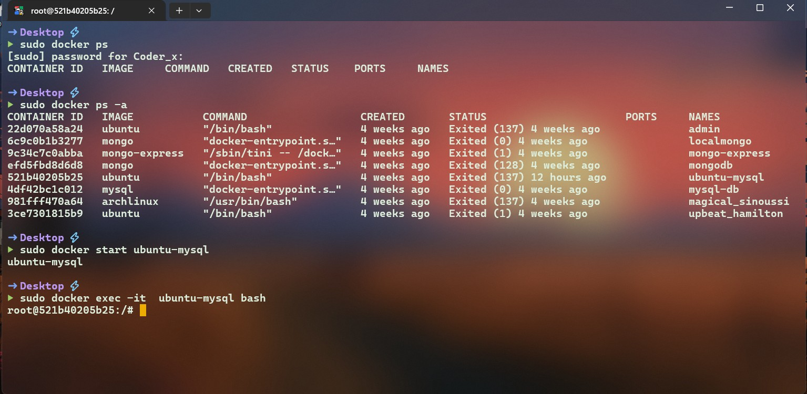
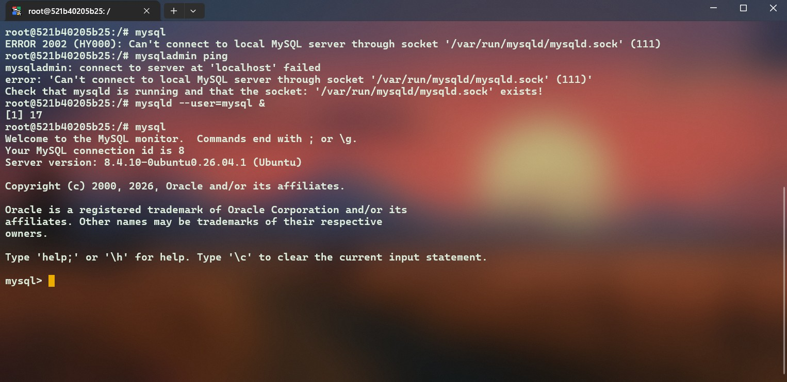
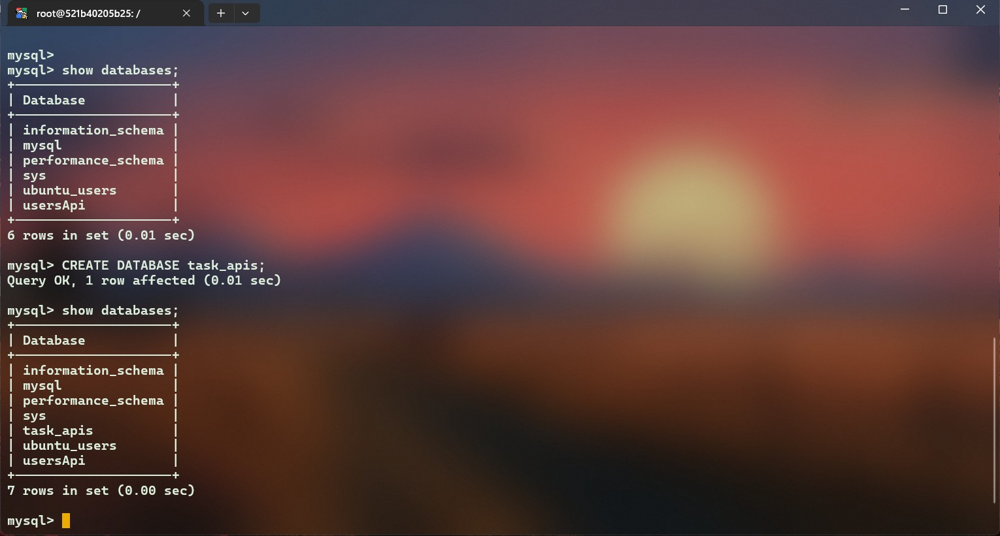

## mysql database run in docker -> 

- maine use ubuntu container k ander config kra hai 




```sh 

sudo docker start ubuntu-mysql

sudo docker exec -it ubuntu-mysql bash

```

## starting mysql in ubuntu




## create db for this project 




## Error 
  - *Error: Access denied for user 'ubuntu_root'@'%' to database 'task_apis'*

- how to solve ?? 

### Grant All permission to this database 
```sql

 GRANT ALL PRIVILEGES ON task_apis.*  TO 'ubuntu_root'@'%';

```
