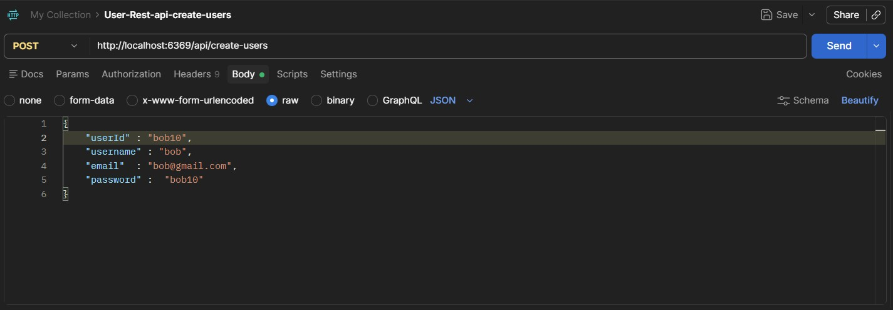
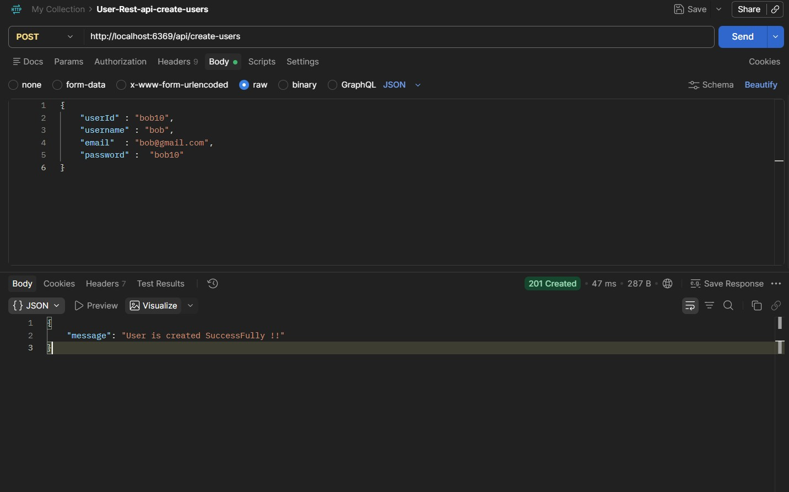
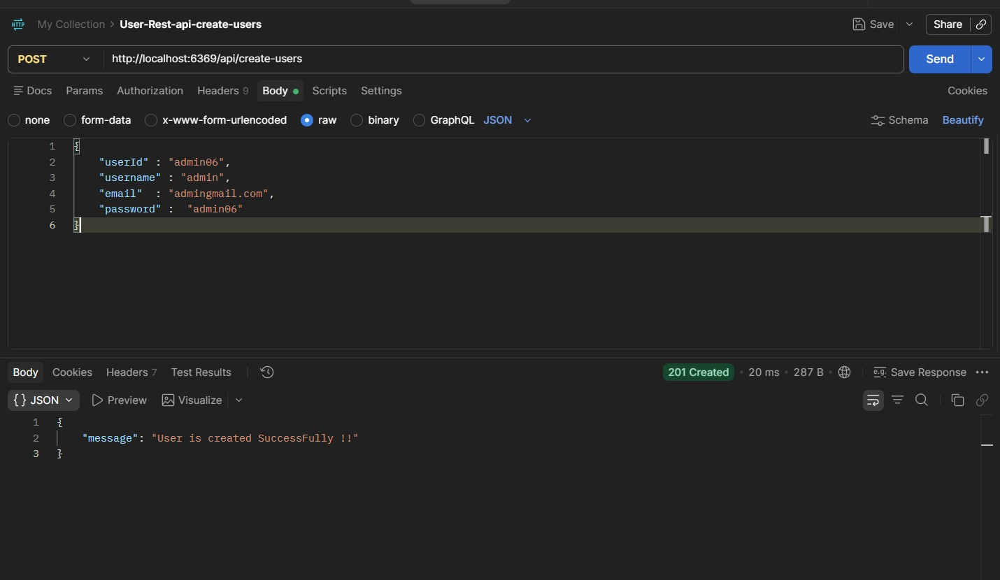
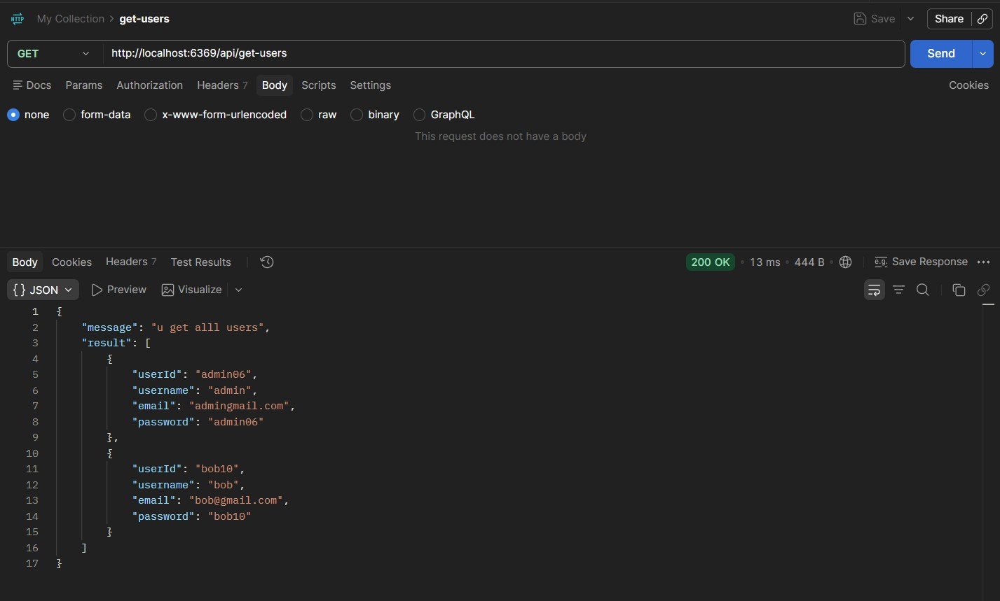
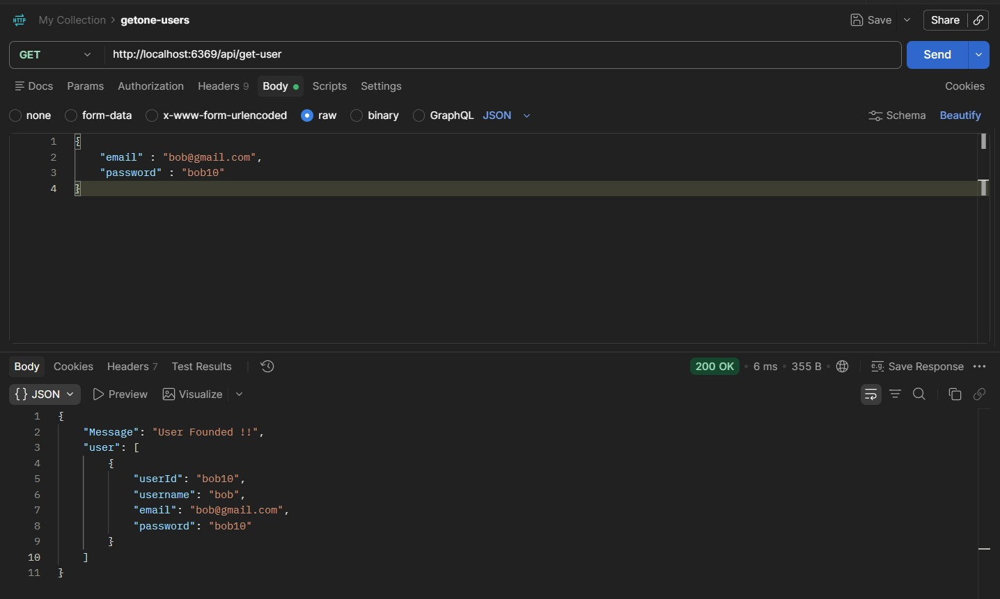
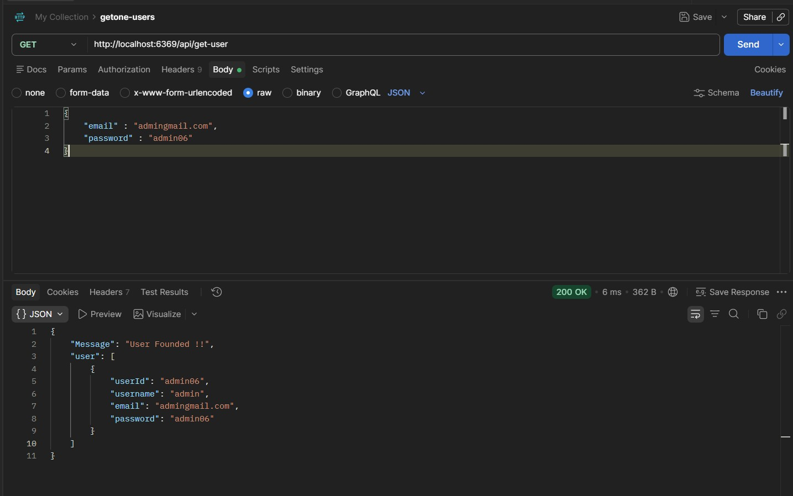
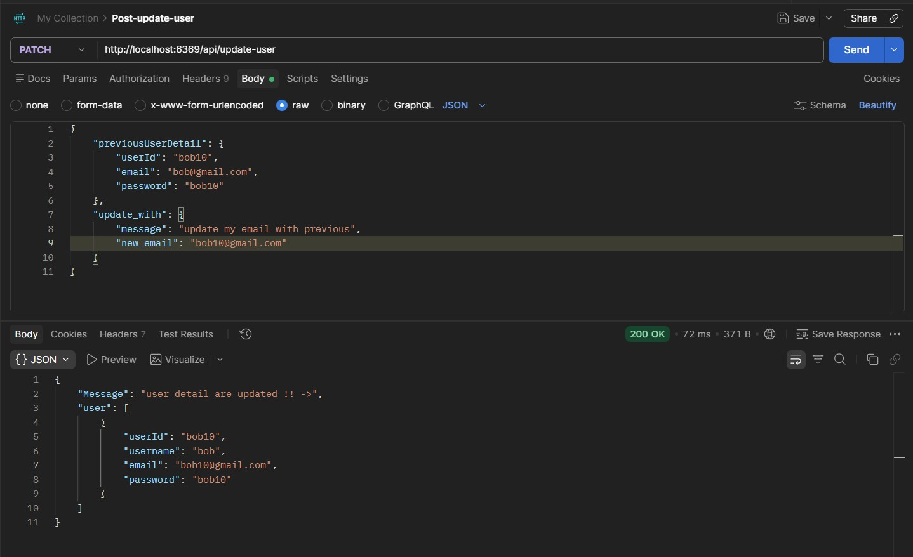
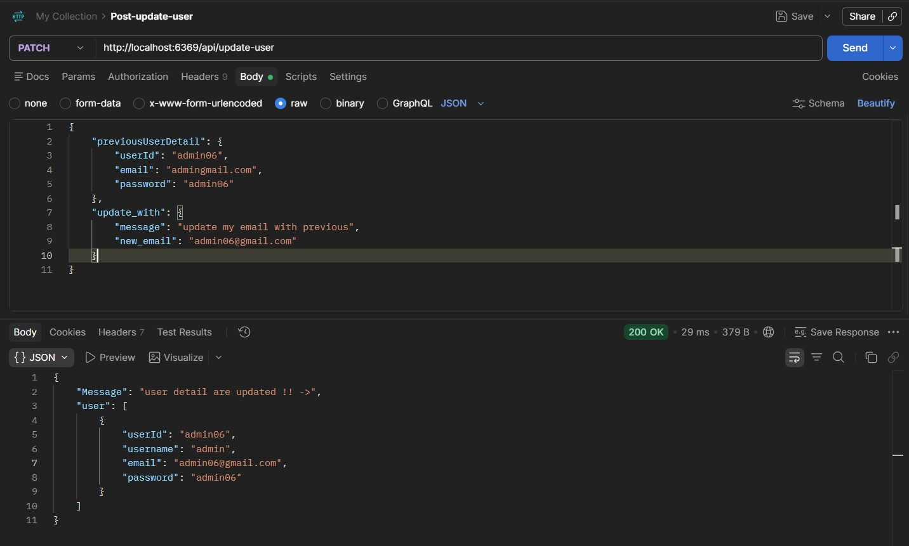
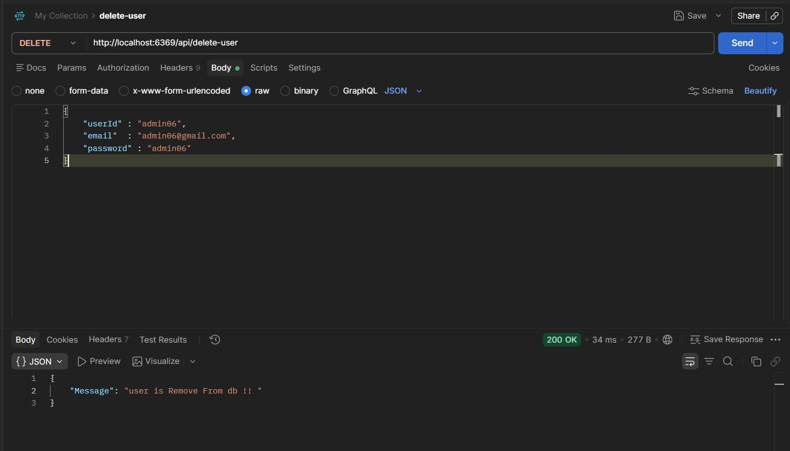
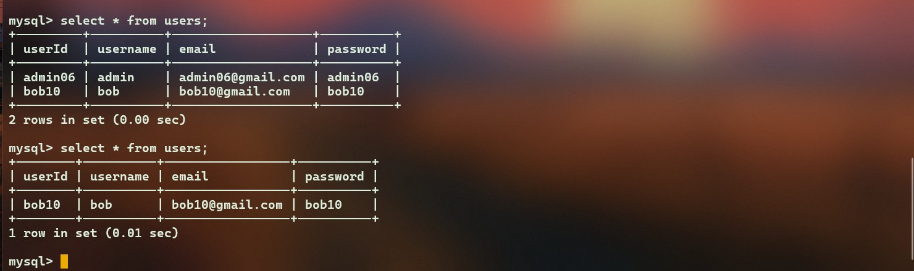

# Rest-Api-Users Backend !! 


 ## Create user ->> 
  - lets test my create-user api 

```json
    "route(endpoint)->"   : "http://localhost:6369/api/create-users" 

```


- ### Request Image -> 

 


- ### Response Image ->  






----------
*********


 ## Get users (all Users) ->  

```json
    "route(endpoint)->"   : "http://localhost:6369/api/get-users" 

```
  - ### Request&Response -> 




## Get Specific User -> 

```json
    "route(endpoint)->"   : "http://localhost:6369/api/get-user" 
```

  - ### Request & Response






------
***********


## Update user (update email only for now)

```json
    "route(endpoint)->"   : "http://localhost:6369/api/update-user" 
```

 - ### Request & Response 

  
  
  


---------
*********

## Delete user 

 - ### Request & Response 

 
 
 - ### DB verify user is removed now  
 


------------------------


